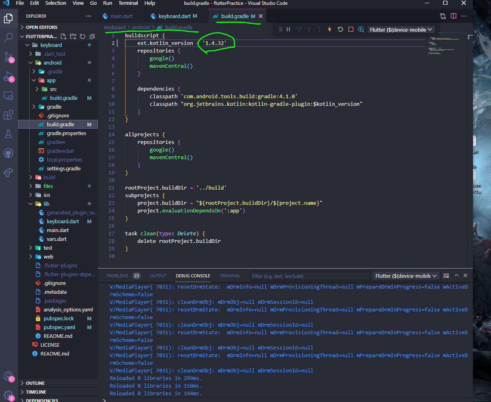

# keyboard

Play Audio in flutter app using this package from pubdev.

 - Audioplayers https://pub.dev/packages/audioplayers

## Getting Started

- ### Add Dependencies of the package in pubspec.ymal

- ### Go to the file and change [ ext.kotlin_version = '1.4.32' ]

- ### Go to the file and change [minSdkVersion 19]

- ### Import and use => import 'package:audioplayers/audioplayers.dart';

 - ### Call this even for multiple audio files
```
AudioCache player = AudioCache(prefix: 'files/');
    player.play('01.wav');
    player.play('02.wav');
```
 - ### files are kept in 

### If shows error like: 
*Several variant outputs are configured to use the same file name "resources-debug.ap_", filters : SINGLE:SINGLE*
Close and reopen IDE
flutter clean
flutter run