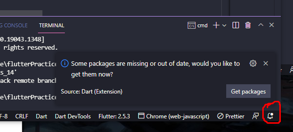
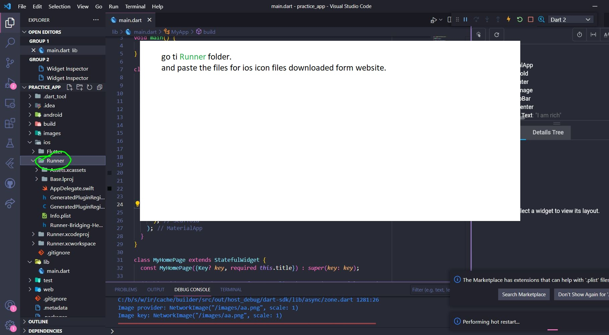
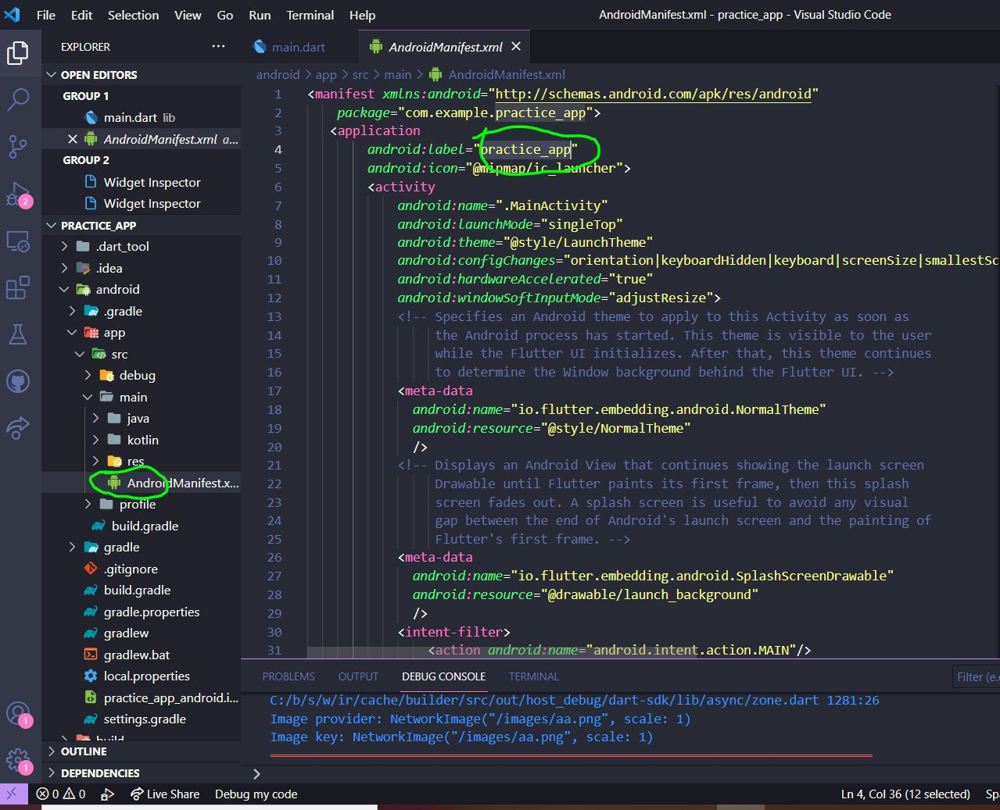
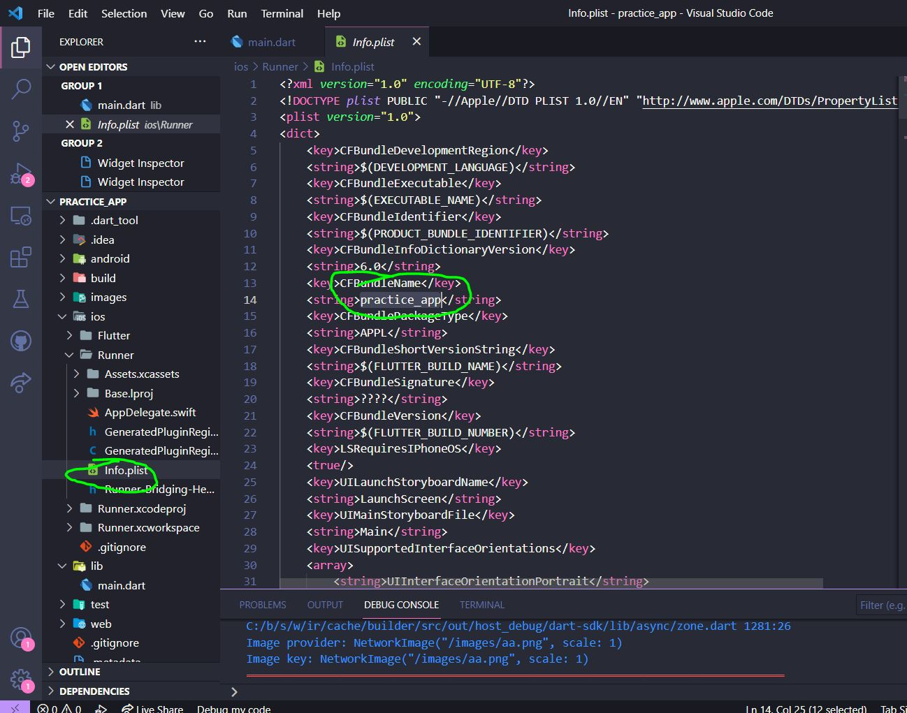

# Basic Layout

## Notes
 - ### Creating a flutter project 
flutter create app_name
 - ### Clone a flutter project from github
  *Get the packages required in VsCode*
  
 - ### Basic Structure of a page
MaterialApp > Scaffold > SafeArea
 - ### Separate in multiple files as stateful or stateless widget and import as packges
```
import 'package:practice_app/home_page.dart';
    MaterialApp > Scaffold > SafeArea
        body: myHomePage()),
```
 - ### Uncomment line: 61 in *pubspec.yaml*, To Use files in the project.
```
assets:
    - files/images/
```
 - ### `debugShowCheckedModeBanner: false,` To erase debug mark from the app at screen top

 - ### Show Image:
 1.  `Image(image: AssetImage('files/images/image.png')),` // file location
 2.  `Image(image: NetworkImage('url')),` //  url of the image

 - ### To Change Android app Icon: go to the `res` folder


 - ### To Change IOS app Icon: go to the `Runner` folder




 - ### To Change App Name Android: go to the `AndroidManifest.xml` folder



 - ### To Change App Name IOS: go to the `Info.plist` file



