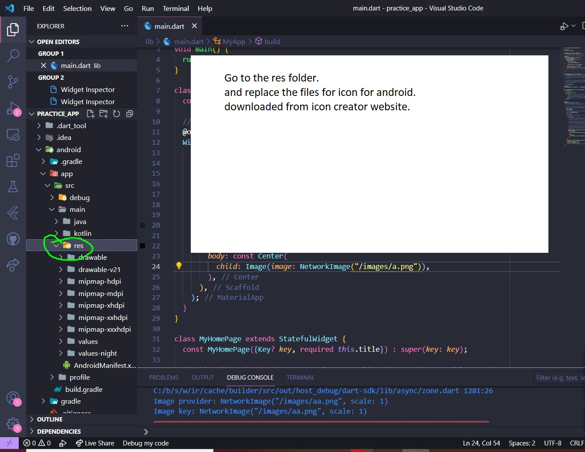

# practice_app

A new Flutter project.

## Getting Started

This project is a starting point for a Flutter application.

A few resources to get you started if this is your first Flutter project:

- [Lab: Write your first Flutter app](https://flutter.dev/docs/get-started/codelab)
- [Cookbook: Useful Flutter samples](https://flutter.dev/docs/cookbook)

For help getting started with Flutter, view our
[online documentation](https://flutter.dev/docs), which offers tutorials,
samples, guidance on mobile development, and a full API reference.

## Class Notes
 1. Uncomment line: 61 in *pubspec.yaml*, To Use files in the project.
assets:
    - files/images/

 2. ```debugShowCheckedModeBanner: false,``` To erase debug mark from the app at screen top
Show Image:
 3. Image(image: AssetImage('files/images/aa.png')), // file location
 4. Image(image: NetworkImage('url')), //  url of the image
 5. Change icon
